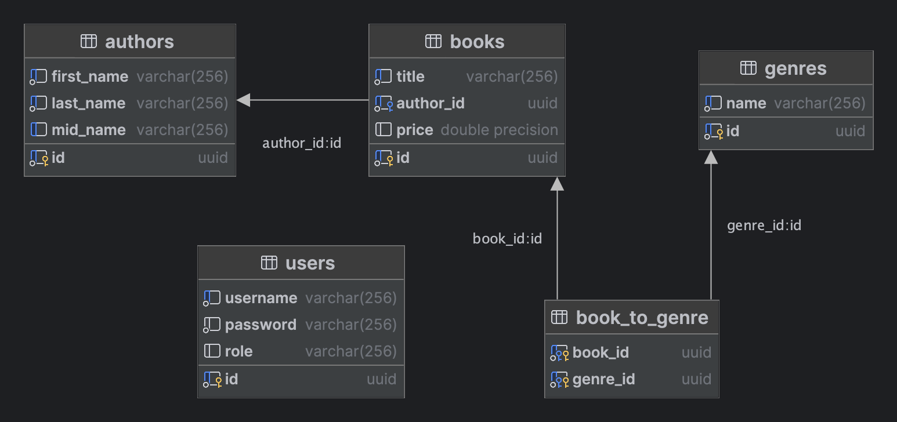

# BookStore Inventory Management System
**Author: *Anatolii Anishchenko***

## Description
The Bookstore Inventory Management System is a web application (REST API only)
that allows bookstore owners to manage their inventory efficiently. 
It provides features for adding, updating, and searching for books.

## Key Features
1. Book CRUD Operations [REST API]:
   * Add new books with details like title, author, genre, and price.
   * Update existing book information.
   * Delete books from the inventory.
2. Search Functionality [REST API]:
   * Search for books by title, author, or genre.
   * Display search results in a paginated format.
3. Authentication and Authorization:
   * Implement basic authentication for bookstore staff.
   * Differentiate between admin and regular users.
   * Admins can perform all CRUD operations, while regular users can only view books.

## DB diagram

## Docs
### [Run guide](docs/run_guide.md)
### [API description](docs/api.md)
